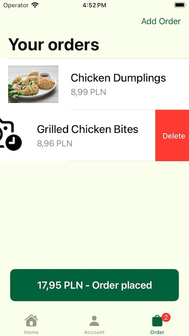

# AppStawki 🥟🫕

**AppStawki** This simple appetizer service client written using SwiftUI framework. This application was designed to simulate the operation of a bar serving appetizers. The app provides a modern and responsive user interface, showcasing the capabilities of Apple's latest frameworks.

## Features

- **Modern Architecture**: It is an example how to use MVVM architecture.
- **Unit Tests** Classes are covered by unit tests to present how screen logic can be verified using mocked data. 
- **User Interface**: The app features a clean and intuitive UI built using SwiftUI, allowing for smooth navigation and interaction.
- **Localization**: Demonstrates how to implement localization using a string catalog, making it easy to adapt the application for different languages and regions.
- **Appetizer Management**: Users can view, add, and manage various appetizers available at the bar.

## App Preview

  

## Usage
This application serves as a practical example for developers looking to enhance their skills with SwiftUI and localization techniques. You can explore the codebase to understand how various components are implemented and how data flows through the app. By utilizing this code, you can deepen your understanding of SwiftUI and latest practices in iOS development. Happy analysing!

## Technologies Used

- **SwiftUI**: User interface defined using declarative syntax.
- **Swift Testing**: I wrote a few tests using new apple unit testing. An intuitive layout and seamless interactions with significantly less code compared to traditional UIKit approache. It also provides code example how to use UIKit view controller represented as view to handle backward compatibility scenario.
- **Nimble** Most of app unit test use nimbe to get nice and descriptive code.
- **Snapshoot testing** There are 3 tests that verify appetisers list for state = {.loading, .success, .failed}
